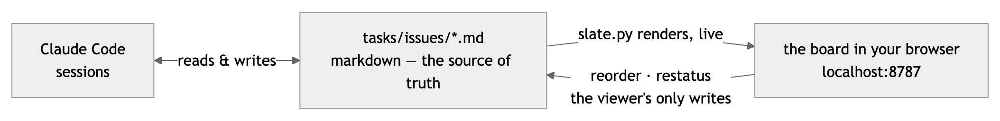

<h1 align="center">
  s l a t e
  <br>
  <sub>long-horizon project tracking for agents and their humans</sub>
</h1>

<p align="center">
  <strong>Ask not what your AI can do for you. Ask what you can do for your AI.</strong>
</p>

AIs are 💩 for long-horizon project management. They need humans for oversight and direction.

The trouble is, the way AIs natively track their work in text files is indecipherable to humans in a hurry. 

Slate defines an AI-friendly markdown format for AIs to track project tasks along with a server for rendering those tasks in a live HTML dashboard. The result is a Linear-like board that your Claude Code knows how to drive. As Claude creates and updates tasks for itself, the board updates in real time. Shaping and executing tasks becomes a true pairing excercise.

Could you do all of this with a legacy SaaS task tracking system? Kind of, sort of, not really. Unlike those solutions, slate stores everything locally on disk so there are no API calls and your AI has access to everything all at once. AIs work better, faster this way.

Slate is built for the solo-developer, multiple-agent model of building software. However, since slate tasks are stored in your repo along with your code, there's no reason in principle why slate wouldn't work in a multi-developer setting at least to some extent. YOLO and YMMV, so give it a rip!

<p align="center">
  
</p>

---

## How it works

<p align="center">
  <picture>
    <source media="(prefers-color-scheme: dark)" srcset="docs/how-it-works-dark.png">
    
  </picture>
</p>

- **Claude Code works the files directly.** No API, no MCP server, no credentials — the installer puts a managed block in your root `CLAUDE.md`/`AGENTS.md` that teaches it the conventions, and from then on it files, updates, and closes issues as it works.
- **`slate.py` renders the files into a live board.** Any change on disk appears in place, scroll held. One Python file, stdlib only, disposable — the tracker is the markdown.
- **The board writes back exactly three things.** Drag a row to reorder, click the status chip on an issue, or tick a todo checkbox: the viewer rewrites `order:` / `status:` frontmatter or the one `- [ ]` / `- [x]` line, nothing else, ever.
- **Presence.** The viewer watches Claude Code's session transcripts and puts a pulsing dot on the issues an agent is touching *right now* — like cursors in a shared doc, never written to the files.

slate is built for **Claude Code** today: the installer wires it up, and presence reads its transcripts. The files are plain markdown any agent could adopt, but others aren't wired up automatically yet.

---

## Start

**1. Install** — from your repository root:

```sh
bash <(curl -fsSL https://raw.githubusercontent.com/kkurian/slate/main/install.sh)
```

**2. Hand the agent a project:**

```sh
claude "plan the payment-retry work as slate issues"
```

**3. Open the board:**

```sh
python3 tasks/slate.py    # → http://localhost:8787
```

That's it. Issues appear as the agent files them, dots pulse on what it's touching, and tomorrow's session inherits today's plan — the project keeps moving instead of starting over. The only requirements are Python 3 and `curl`: no account, no database, no pip, no build step.

---

## Why markdown-first

Slate inverts the usual task tracker structure.

Legacy task trackers primarily store things in a database and serve an interactive visual interface, with agents reaching the database through a second-class API.

Slate makes local markdown files primary — one file per issue, exactly what an agent natively reads and writes. The visual interface is rendered from the files and largely static. The agent, not the human, manages the markdown files and therefore the tasks.

This allows humans and AIs run projects together. The human gets a familiar web UI. The AI gets structured, local text.

With markdown as the system of record, your entire project plan lives in your repo, branches with it, diffs in review, and outlasts any session, any viewer, any vendor. You can even delete the `slate.py` renderer and the project is still all there.

---

## What the installer does

One command from the repo root leaves you with this:

```
your-repo/
├── CLAUDE.md          ← managed block appended (or AGENTS.md — whichever you use)
└── tasks/             ← or any directory you pass as the argument
    ├── project.md     ← starter overview; yours from here on, never overwritten
    ├── issues/        ← one markdown file per issue
    ├── todos/         ← optional: per-person day todos (created as needed)
    ├── days/          ← optional: one YYYY-MM-DD.md naming the issues in play (created as needed)
    ├── templates/
    │   └── issue.md   ← copy to create an issue
    ├── AGENTS.md      ← the tracker conventions the agent loads
    └── slate.py       ← the viewer
```

- **Re-run any time to update slate.** Your `project.md`, your issues, and your existing agent instructions are never touched.
- **The managed block is what makes the agent show up.** It goes in the **root** instructions file because that's the one an agent loads no matter where in the repo it works:

  ```
  <!-- slate:begin -->
  ## Task tracking (slate)
  ...
  @tasks/AGENTS.md
  <!-- slate:end -->
  ```

  `CLAUDE.md` gets an `@`-import, which Claude Code loads every session; `AGENTS.md` gets a path reference, since it has no import mechanism. Re-run just this step with `python3 tasks/slate.py install`.

---

## The viewer

```sh
python3 slate.py            # live board at http://localhost:8787
python3 slate.py build out  # standalone HTML in ./out/ — no server needed, no write paths
python3 slate.py doctor     # read-only audit: flag stale states, exit nonzero if any
```

- **Live, everywhere.** `project.md` is the overview, each status a view, each issue a page. Navigation swaps in place; a file edited on disk updates the open page and holds your scroll. Even `slate.py` reloads itself: edit it and the server re-execs — a syntax error leaves the old server running until you fix it.
- **Waves.** Give an issue a `wave:` — an integer or a short label — and a **Waves** dashboard appears in the sidebar, counting the distinct waves. Each wave shows its progress there as a fractional pie and a `done/total` count, with the issues in flight first and a trailing *No wave* section so nothing is hidden (numeric waves first ascending, then labels alphabetical; a label can pin its position with a leading number — `0 — hotfix` sorts before wave 1). Any status view whose issues carry waves groups into `Wave 1`, `Wave 2`, … sections too — dragging still reorders within a section. Set no waves and it all stays away: a board without waves renders exactly as before. Display-only, like every other view.
- **Agent presence.** The viewer watches Claude Code's transcripts (`~/.claude/projects/<project-slug>/`, workflow subagents included; override with `SLATE_TRANSCRIPTS`). A transcript written in the last 90 seconds is a live agent: the sidebar counts agents — and workers, when a workflow fans out — an issue pulses while its file is the target of a tool call, and its page shows an "agent working" badge. Presence is ephemeral: never written to the markdown, absent from static builds, a hint rather than an audit log.
- **PR review state.** Give an issue a `pr:` — a number or a list — and the live server asks `gh` where each pull request's review stands, showing one aggregate glyph on the row (review pending, approved, changes requested, merged, or closed) and a per-reviewer breakdown in the issue page's Properties panel. It runs `gh` against the repo `slate.py` sits in; set `SLATE_REPO=owner/repo` to point elsewhere. The `gh` round-trips never sit on a page load: every render answers from last-known state while expired entries refresh on background threads, and the landed refresh live-reloads open pages. A PR whose first fetch is still in flight shows a dashed unknown ring (and a muted *checking* chip on the issue page) rather than nothing, resolving to its real glyph on the repaint. Like presence, it is display-only, never written to the markdown, absent from static builds, and fails soft — no `gh`, offline, or an unknown number simply drops that PR and the rest renders unchanged.

- **Pull requests view.** Once any issue carries a `pr:`, a **Pull requests** view appears in the sidebar beside Waves, its badge counting the open PRs. It lists one row per distinct pull request — issues sharing a PR list it once, linking back to each — grouped by review standing: *Changes requested*, *Awaiting review*, *Approved*, then muted *Merged* and *Closed* sections. Each live row carries the PR title, a draft/ready chip, and its reviewers with their verdicts and ages laid out in the open. With `gh` unavailable the view still lists every PR number and its issues from the frontmatter, each still linking to GitHub.
- **Today.** A day view of the working set, backed by per-person todo files. Drop a `todos/<person>.md` beside `issues/` — YAML `person:` frontmatter, then dated `## YYYY-MM-DD` sections (newest first) of plain `- [ ]` / `- [x]` items, `[[T-13]]` wikilinks tying each item to the issues it serves — and a **Today** view appears in the sidebar (its badge the still-open count on the newest day). The view groups by day, newest at top, each person's items inside the day, above a muted chip row of the issues that day links. The board's overview grows a matching **Today** panel: per person, today's items plus any still-unchecked item carried from an older day (tagged with its origin date). Indented lines under an item are its collapsible instructions — write the full WHAT/WHY/what-happens there and the item line stays scannable. Ticking a box is the one write: it flips that single line between `- [ ]` and `- [x]` in the person's file, located by a hash of the line; if the line has drifted (edited, or already toggled by another push) the write is refused with a 409 and the next reload shows the file's truth. One file per person so concurrent pushers merge cleanly; set none and Today stays away, like every other lens.
- **Days.** A day file names the issues in play. Drop a `days/YYYY-MM-DD.md` beside `issues/` — optional `title:` frontmatter labels the day; a top-level list line beginning with an issue wikilink puts that issue in play, and text after the link (set off with an em dash if you like) is the intent: `- [[T-12]] — verify syncs land clean`. Everything else in the body is notes, rendered as markdown. When today's file exists, the Today panel and the Today view pivot to an issue spine: one row per in-play issue (with its wave chip — the day cuts across waves), intent muted beneath, and each person's todo items for the day nested under the issue they link, checkboxes live; issues only the todos mention follow as muted *Also in play* rows, and unlinked items trail per person. Past days with files render at `/day/<date>` (and `day-<date>.html` in a static build). A day file naming an issue that does not exist renders the link fail-soft, wears a strip on the day surfaces, and is flagged by `doctor`. One file per day, append-friendly under concurrent pushes; without a day file, Today falls back to the per-person layout above, and with neither the surfaces stay away entirely. Display-only — the viewer never writes a day file.
- **Three write paths, no more.** Drag a row within a status view to reorder it (Esc cancels), click the status chip on an issue page to move it, or tick a todo checkbox on the Today panel or view. Each rewrites only what it names — `order:` / `status:` frontmatter on the issues involved, or the one `- [ ]` / `- [x]` line in a person's todo file.
- **Doctor.** The live board audits itself: an issue sitting in **In Review** while every one of its `pr:` pull requests has merged is usually a status flip that was missed — the work landed but the issue never left review. The server evaluates that check on every render from the same cached PR state the review glyphs read, no extra `gh` calls, so the smell is visible the moment the board is: a warning chip on the issue's row, a one-line strip atop the In Review view naming the offenders, and a badge on the issue page beside the very status chip that needs the flip. A review status that is intentional even with every PR merged — awaiting a human flip, follow-up work, or a review happening off GitHub — carries a `review_hold: <reason>` field, which trades the warning for a muted *held* chip. `python3 slate.py doctor` is the same check as a one-shot CLI: fresh `gh` fetches, a printed report, a nonzero exit when anything is flagged — it fits a pre-push or CI check. Both surfaces are read-only (doctor never rewrites a file), read only the `pr:` frontmatter (PR numbers in body prose are out of scope), and fail soft when `gh` can't resolve a PR.
- **Knobs.** `SLATE_PORT` sets the port; drag the sidebar's edge to resize it. `SLATE_REPO` (`owner/repo`) points `doctor` and the review glyphs at a repo other than the one `slate.py` sits in.

---

## Format

A project file and one file per issue — markdown with YAML frontmatter. Copy `templates/issue.md` to `issues/<ID>.md` and it's on the board, no rebuild.

```markdown
---
id: T-1
title: Short imperative summary
status: In Progress
priority: High
assignee: Ada
labels: [backend]
---

## Description
What this is and why it matters. Link issues with [[T-2]] wikilinks.

## Acceptance criteria
- [ ] A concrete, checkable outcome
```

| field | values | drives |
|---|---|---|
| `status` | Backlog · Todo · In Progress · In Review · Done · Canceled | which view the issue is in, sidebar counts |
| `priority` | Urgent · High · Medium · Low · No priority | the priority marks |
| `order` | integer, optional | position within the status — set by dragging, or by hand |
| `wave` | integer or text, optional | groups the issue in the Waves dashboard and in status views |
| `pr` | number or list, optional | shows the linked pull request(s)' review state on the row and issue page |
| `review_hold` | text, optional | reason an In Review issue stays put even with every PR merged; `doctor` lists it held, not flagged |

Link issues with `[[T-2]]` wikilinks. The sidebar brand shows the `title` from your `project.md`, so slate reads as native to the project it sits in.

---

## Design

Zero-dependency other than Python standard library. Markdown as source of truth. Human intelligible. Built for agents and their humans, by agents and their humans.

---

## License

MIT. See [LICENSE](LICENSE).
