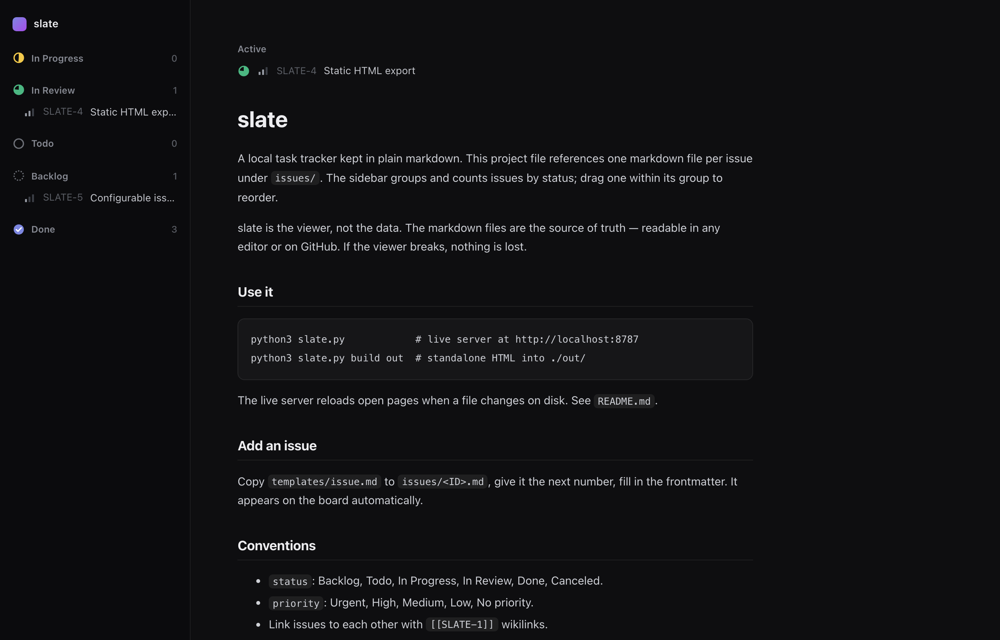

<h1 align="center">
  s l a t e
  <br>
  <sub>AI task tracking for humans</sub>
</h1>

Humans and AIs build software together, and both need to track the work. The problem is they perceive things differently. A human comprehends spatially: meaning is carried by arrangement, and a board makes state legible at a glance. An AI takes no benefit from layout — it reads structure directly in the text and writes it back in the same form.

A normal tracker resolves this for the human: the work lives in a database behind a visual interface, and the machine reaches it through an API, second-class. slate inverts the order. The work is plain markdown — one file per issue, what an agent reads and writes natively — and the board is rendered from it, for you. Neither reader is an afterthought.

The markdown is the system of record. The viewer is a single Python file, standard library only. Delete it and nothing is lost.

<p align="center">
  
</p>

---

## Install

From your repository root:

```sh
bash <(curl -fsSL https://raw.githubusercontent.com/bioneural/slate/main/install.sh)
```

This copies slate into `tasks/` (pass a different directory as the argument), writes a starter `project.md`, and makes your agent aware of the tracker. Re-run any time to update; your `project.md`, your issues, and your `CLAUDE.md` content are left untouched.

The only requirements are a Python 3 interpreter and `curl` — both already on your system. The viewer itself uses nothing but the Python 3 standard library: no pip, no npm, no build step.

### How the agent learns about slate

The installer writes a managed block into your repository's **root** `CLAUDE.md` that imports `AGENTS.md` and tells the agent to track work in slate:

```
<!-- slate:begin -->
## Task tracking (slate)
...
@tasks/AGENTS.md
<!-- slate:end -->
```

This step is required. Claude Code always loads the **root** `CLAUDE.md`, but a nested one loads only when the agent works in that subtree, and `AGENTS.md` is not auto-loaded at all — so the root import is the only thing that makes an agent working anywhere in the repo aware of the tracker. Run it alone any time with `python3 tasks/slate.py install`. Other agent tools can reference `AGENTS.md` directly.

---

## Use

```sh
python3 slate.py            # live server at http://localhost:8787
python3 slate.py build out  # write standalone HTML into ./out/
```

The live server renders `project.md` as a board and each `issues/*.md` as an issue. Navigation is instant — pages swap without a full reload. When any file changes on disk, open pages update in place and hold their scroll position.

`build` emits self-contained HTML you can open without the server, or hand to someone who has no runtime at all.

Set `SLATE_PORT` to override the default port.

---

## Format

A project file and one file per issue. Both are markdown with YAML frontmatter.

```markdown
---
id: T-1
title: Short imperative summary
status: In Progress
priority: High
assignee: Ada
labels: [backend]
---

## Description
What this is and why it matters. Link issues with [[T-2]] wikilinks.

## Acceptance criteria
- [ ] A concrete, checkable outcome
```

- `status`: Backlog, Todo, In Progress, In Review, Done, Canceled — drives the sidebar grouping and the board counts.
- `priority`: Urgent, High, Medium, Low, No priority — drives the priority marks.
- Link issues to each other with `[[T-2]]` wikilinks.

Copy `templates/issue.md` to `issues/<ID>.md` to create an issue. It appears on the board with no rebuild. The sidebar brand shows whatever `title` you set in `project.md`, so slate reads as native to the project it sits in.

---

## Design

- The markdown is the source of truth. The viewer is disposable.
- Read-only by construction. The server answers GET and nothing else; it cannot alter the tracker.
- One renderer, two outputs. The live server and the static build share the same rendering, so they cannot drift.
- Zero dependencies. Standard library only.

The viewer renders a focused subset of markdown — headings, lists, task checkboxes, tables, code, blockquotes, links, and wikilinks — enough for issues.

---

## License

MIT. See [LICENSE](LICENSE).
